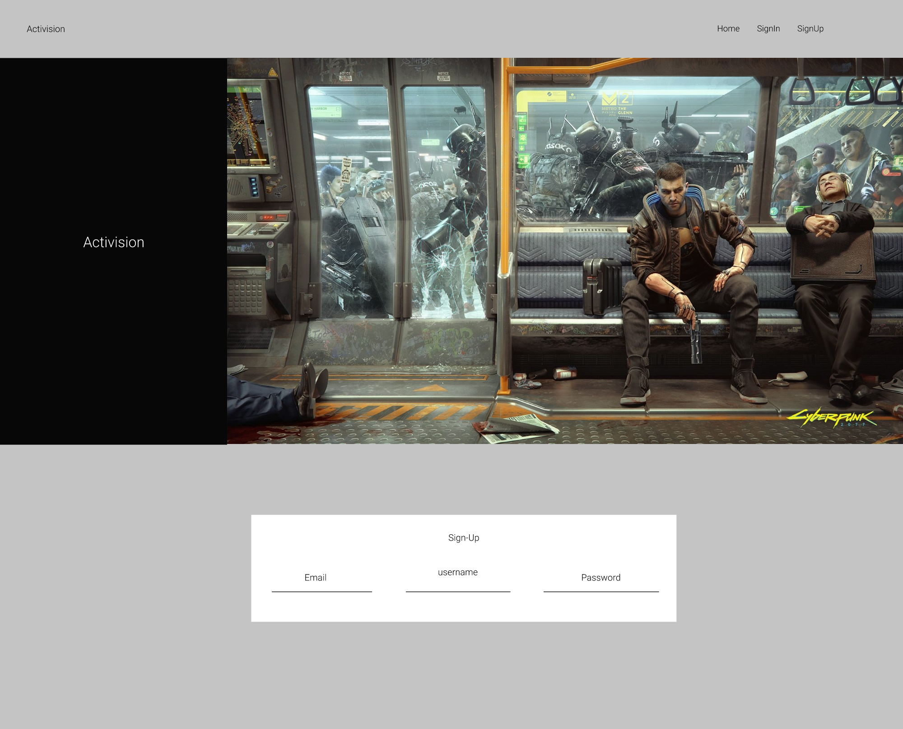

# Activision-Passion-Project

## Overview

_**Activision** is a website based on the offical website from Activision. This website will have a blog post gaming news that is associated with Activision|Blizzard like Call of Duty, Overwatch, WoW and more


<br>

## MVP

> The Minimum Viable Product should be a well-planned, easily-communicated product, ensuring that the client's deliverable will be achievable and meet specifications within the time frame estimated.

_The **Project Title** MVP lorem ipsum dolor sit amet, consectetur adipiscing elit. Phasellus dapibus fermentum risus vitae bibendum. Integer vel ipsum mollis odio sollicitudin ornare eu vel ex. In quis fringilla velit, ac maximus quam. Etiam eget placerat neque. Aenean faucibus sem non nisi lobortis ullamcorper._

<br>

### Goals

- _Rails configuration,_
- _Full CRUD for front and back end._
- _interactivity._
- _post create delete._
- _etc._

<br>

### Libraries and Dependencies

> Use this section to list all supporting libraries and dependencies, and their role in the project. Below is an example - this needs to be replaced!

|     Library      | Description                                |
| :--------------: | :----------------------------------------- |
|      React       | _Front-end._ |
|   React Router   | _Routing to different parts of the website._ |
|     SQL     | _Database searching._ |
|  Rails | _axios calls for CRUD._ |

<br>

### Client (Front End)

#### Wireframes

> Use the Wireframes section to display desktop, tablet and mobile views. No hand-drawn wireframes. Use a tool like wireframe.cc, Whimsical or AdobeXD



<br/>

#### Component Architecture

> Use this section to define your React components and the data architecture of your app. This should be a reflection of how you expect your directory/file tree to look like. 

``` structure

src
|__ assets/
      |__ fonts
      |__ graphics
      |__ images
      |__ mockups
|__ components/
      |__ Header.jsx
|__ services/

```

#### Time Estimates

> Use this section to estimate the time necessary to build out each of the components you've described above.

| Task                | Priority | Estimated Time | Time Invested | Actual Time |
| ------------------- | :------: | :------------: | :-----------: | :---------: |
| Add Contact Form    |    L     |     3 hrs      |     2 hrs     |    3 hrs    |
| Create CRUD Actions |    H     |     3 hrs      |     1 hrs     |     TBD     |
| TOTAL               |          |     6 hrs      |     3 hrs     |     TBD     |

> _Why is this necessary? Time frames are key to the development cycle. You have limited time to code your app, and your estimates can then be used to evaluate possibilities of your MVP and post-MVP based on time needed. It's best you assume an additional hour for each component, as well as a few hours added to the total time, to play it safe._

<br>

### Server (Back End)

#### ERD Model

> Use this section to display an image of a computer generated ERD model. You can use draw.io, Lucidchart or another ERD tool.


<br>

***

## Post-MVP

> Use this section to document ideas you've had that would be fun (or necessary) for your Post-MVP. This will be helpful when you return to your project after graduation!

***

## Code Showcase

> Use this section to include a brief code snippet of functionality that you are proud of and a brief description.

## Code Issues & Resolutions

> Use this section to list of all major issues encountered and their resolution.
